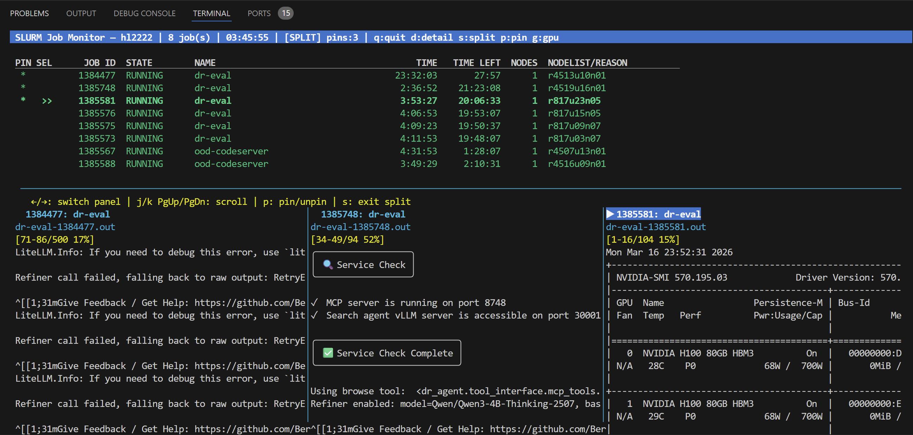

# slurm-monitor

A live terminal dashboard for monitoring SLURM (sbatch) jobs. Auto-refreshes in real time, shows all running/pending jobs, and lets you scroll through log output — no more manual `squeue` + `tail -f`.




## Features

- **Live auto-refresh** — polls `squeue` every 2 seconds (configurable)
- **Color-coded job states** — green for running, yellow for pending, red for failed, etc.
- **Scrollable log viewer** — tails your job's stdout log with full scroll support (auto-detects log file location)
- **Side-by-side split view** — pin multiple jobs and compare their logs in parallel panels
- **GPU utilization panel** — SSHes into allocated nodes to show per-GPU usage and memory via `nvidia-smi`
- **Job detail view** — shows partition, CPUs, GPUs, working directory, and more from `scontrol`
- **Zero dependencies** — uses only Python standard library (`curses`, `subprocess`, `argparse`)

## Requirements

- Python 3.6+
- SLURM cluster with `squeue`, `scontrol` available
- Terminal with curses support (any standard Linux/macOS terminal)
- (Optional) SSH access to compute nodes for GPU monitoring

## Installation

```bash
git clone https://github.com/lihaoxin2020/slurm-monitor.git
cd slurm-monitor
```

No `pip install` needed — it's a single script with no external dependencies.

## Usage

```bash
python3 monitor.py
```

### Options

| Flag | Description | Default |
|------|-------------|---------|
| `-i`, `--interval` | Refresh interval in seconds | `2` |
| `-u`, `--user` | Monitor a specific user's jobs | current user |

```bash
# Refresh every 5 seconds
python3 monitor.py -i 5

# Monitor another user's jobs
python3 monitor.py -u colleague_name
```

### Keyboard Controls

#### Job list

| Key | Action |
|-----|--------|
| `↑` / `↓` | Select job |
| `d` | Toggle detail panel (single job info + log tail) |
| `g` | Toggle GPU utilization panel |
| `p` | Pin/unpin selected job (auto-enters split view when 2+ pinned) |
| `s` | Toggle split view for pinned jobs |
| `q` | Quit |

#### Log scrolling (detail & split views)

| Key | Action |
|-----|--------|
| `j` / `PgDn` | Scroll log down (10 lines) |
| `k` / `PgUp` | Scroll log up (10 lines) |
| `Home` | Jump to top of log |
| `End` | Jump to bottom of log |

#### Split view

| Key | Action |
|-----|--------|
| `←` / `→` | Switch active panel (highlighted with `▶`) |
| `j` / `k` | Scroll the active panel's log |
| `p` | Pin/unpin jobs to add or remove panels |
| `s` | Exit split view |

### Split view workflow

1. Select a job with `↑`/`↓` and press `p` to pin it
2. Move to another job and press `p` again — split view activates automatically
3. Use `←`/`→` to switch which panel receives scroll input
4. Each panel independently scrolls through its job's log
5. Press `p` on a pinned job to unpin it, or `s` to exit split view

## How it finds log files

The log viewer automatically locates your job's stdout log by:

1. Checking `StdOut` from `scontrol show job`
2. Looking for `slurm-<jobid>.out` in the job's working directory
3. Falling back to `slurm-<jobid>.out` in `$HOME`

## Tips

- Add an alias for quick access:
  ```bash
  alias smon='python3 ~/slurm-monitor/monitor.py'
  ```
- Works great over SSH — just make sure your terminal supports Unicode (most do)
- The GPU panel requires passwordless SSH to compute nodes (typical on HPC clusters)
- Use a wide terminal for split view — each panel gets `terminal_width / n_panels` columns

## License

MIT
